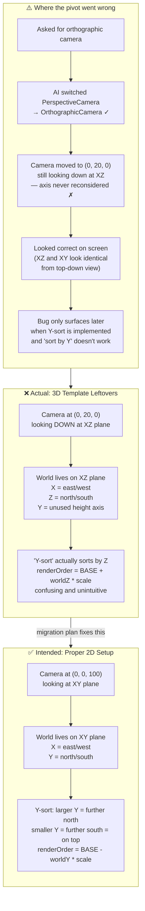

# 2D Migration — Visual Diagram

> **Key insight:** The bug was silent. XZ and XY look pixel-identical through a top-down
> orthographic camera, so there was no visual feedback that anything was wrong. It only
> became painful when Y-sort was implemented and "sort by Y" didn't work — because the
> world was built on Z, not Y.
