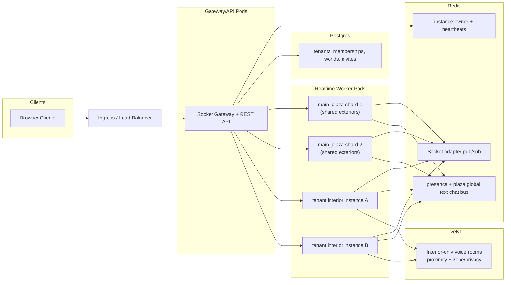

# Performance and Scaling Improvements

> This document covers future performance and horizontal scaling work for the Gather realtime server. None of this is in scope for the PoC. The current single-node in-memory player tracking is intentionally kept simple until load data justifies the added complexity.

---

## 1. Current Baseline

The PoC server uses a single in-memory `playersByWorld` map on one Node.js process. This is acceptable for low concurrent user counts (< 30 per instance). The snapshot broadcast runs at 20 Hz and the simulation loop at 60 Hz, both on the same event loop.

---

## 2. Scale-out Strategy (Redis + Hybrid Runtime)

When moving beyond a single node:

- Keep `playersByWorld` local/in-memory on each worker for per-tick movement, proximity checks, and snapshot generation. Do not move per-frame `PlayerState` into Redis — network and serialization overhead will break tick deadlines.
- Use Redis for cross-node coordination only:
  - global presence/online indexes
  - instance ownership directory + heartbeats
  - Socket.IO adapter pub/sub fanout between nodes
  - short-lived artifacts (handoff tokens, rate-limit buckets)

**When to adopt:** single-node is fine for PoC. Add Redis adapter + distributed presence when moving to multi-node horizontal scale, while retaining local instance simulation loops per worker.

---

## 3. Horizontal Topology (Target Production)

### 3.1 Topology

- **API/Gateway tier:** JWT verification, rate limits, lightweight REST, socket handshake and instance routing.
- **Realtime worker tier (N nodes):** authoritative simulation per owned instance, AOI + delta snapshots + instance-scoped events.
- **Redis tier:** Socket.IO adapter/pub-sub, instance ownership directory + heartbeats, cross-node presence + ephemeral coordination state.
- **Postgres tier:** durable tenant metadata (tenants, memberships, worlds, invites).
- **LiveKit tier:** interior-only voice rooms (proximity + interior zones).

### 3.2 Instance Ownership Model

- Each world instance has exactly one active owner worker at a time.
- Owner worker keeps hot runtime state in-memory for that instance.
- Redis keys track ownership and liveness:
  - `instance:owner:{worldId}` → `{ nodeId, epoch, lastHeartbeatAt }` with TTL.
  - `instance:load:{nodeId}` → occupancy and tick lag metrics.
- Ownership is acquired/renewed by heartbeat; expiry triggers reassignment.

### 3.3 Routing and Handoff Flow

- On `world:join` / `world:change`:
  - resolve target instance owner from Redis directory.
  - if owner is current node, join directly.
  - if owner is another node, perform controlled handoff (redirect payload + short-lived handoff token).
- Client reconnects to target worker and resumes in target instance.
- Authorization is revalidated on final join at the owner worker — never trust redirect alone.

### 3.4 Main Plaza Sharding

- Treat main plaza as multiple instances in production (`main_plaza:1..K`) while preserving one logical plaza UX.
- Assign users to a plaza instance using deterministic routing (consistent hash or least-loaded strategy).
- Keep plaza text chat logically global via a dedicated cross-instance pub/sub channel.
- Interior instances remain isolated per tenant interior world.

### 3.5 Redis Responsibilities (Authoritative Boundaries)

- Redis is for coordination and state distribution, not per-frame simulation storage.
- Store in Redis:
  - Socket.IO adapter channels.
  - presence indexes (`presence:world:{worldId}` sets/hashes).
  - ownership + heartbeat keys.
  - short-lived artifacts (handoff tokens, rate-limit buckets).
- Do not store high-frequency mutable `PlayerState` as the source of truth in Redis.

### 3.6 Failure Handling

- **Worker crash/loss:** heartbeat expires → ownership key invalidated → new owner elected → connected clients receive retry/rejoin signal and reconnect to new owner.
- **Split-brain prevention:** monotonic `epoch` in ownership record; only highest valid epoch may emit authoritative snapshots.
- **Graceful drain:** worker marks itself draining, rejects new joins, hands off active instances before shutdown.

### 3.7 Observability and Autoscaling Signals

Required metrics per worker/instance:
- tick duration and tick lag
- outbound bytes/sec
- AOI fanout size
- snapshot payload size
- socket count + active players per instance

Autoscale triggers should consider:
- sustained high tick lag
- sustained high outbound bandwidth
- sustained occupancy above per-instance target

---

## 4. Snapshot Broadcast Optimization (AOI)

The current snapshot broadcasts all players in an instance to all clients in that instance — O(N²) data per second. At scale, replace with an Area of Interest (AOI) spatial index (grid or quadtree) per instance so each client receives only nearby player states. This reduces effective data per client from O(N) to O(k) where k is average nearby player count.

**When to adopt:** when a single instance exceeds ~50 concurrent players and snapshot payload becomes the dominant bandwidth cost.
