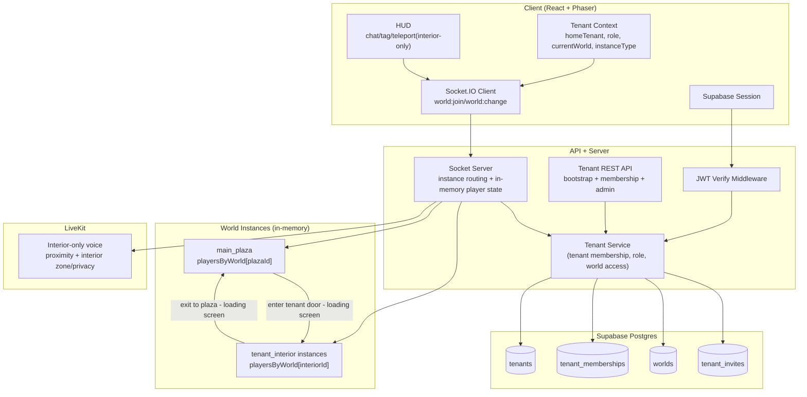
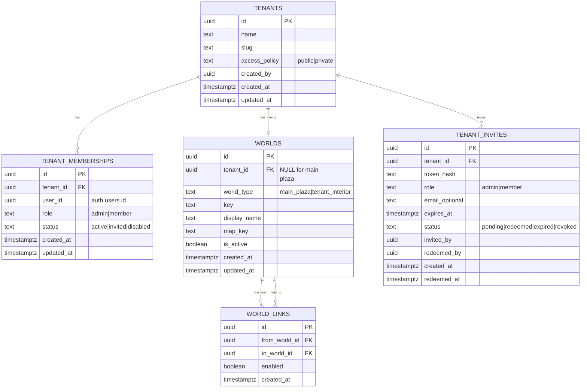
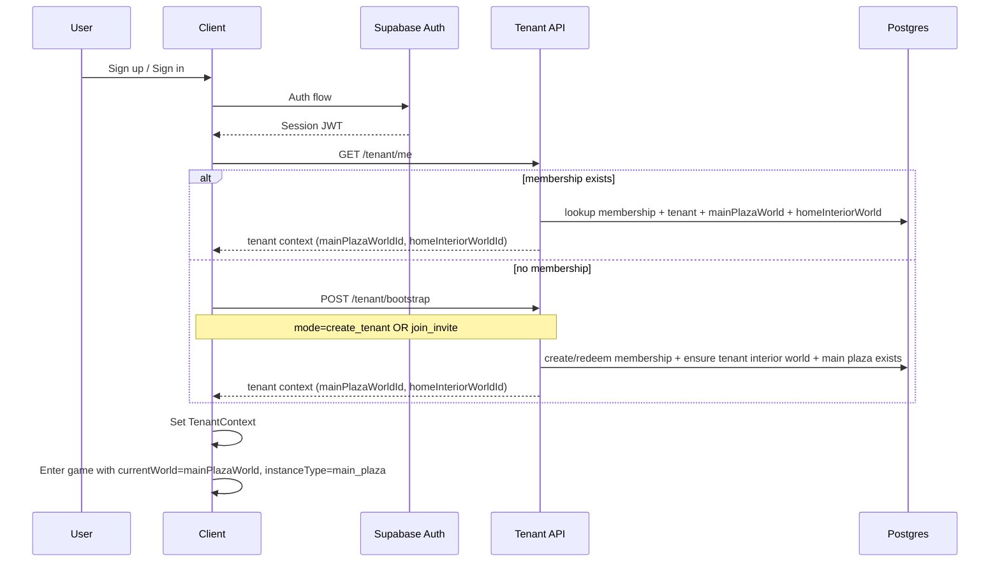
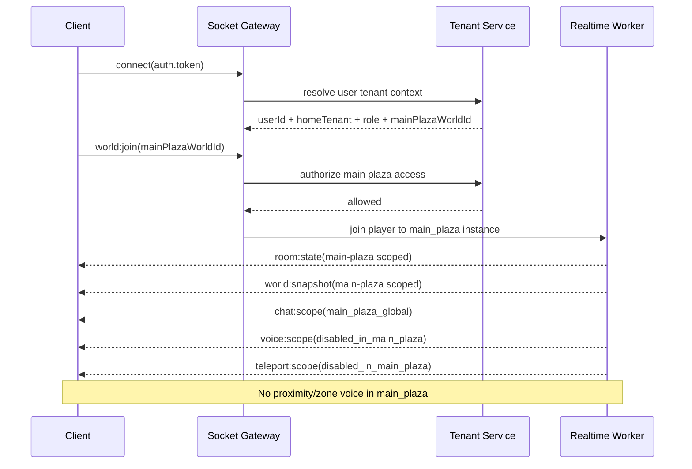
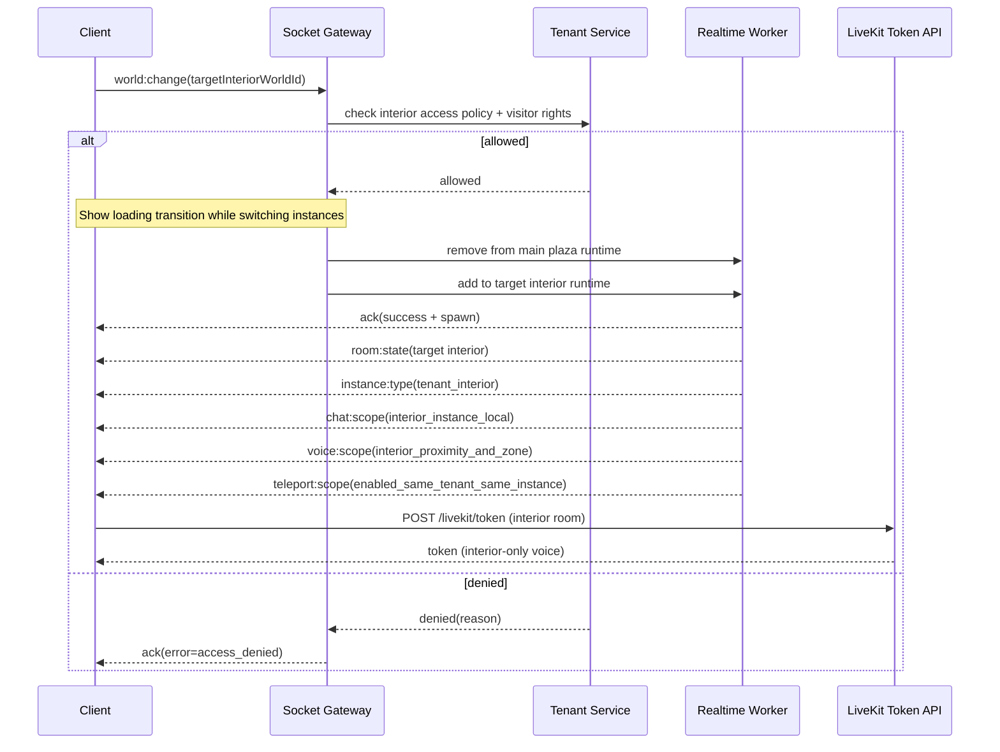
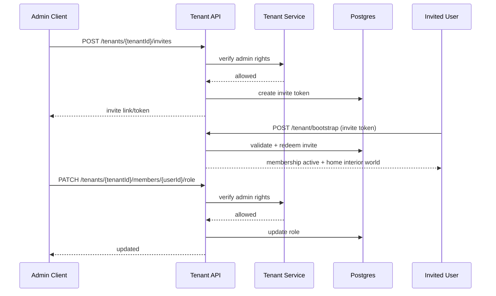
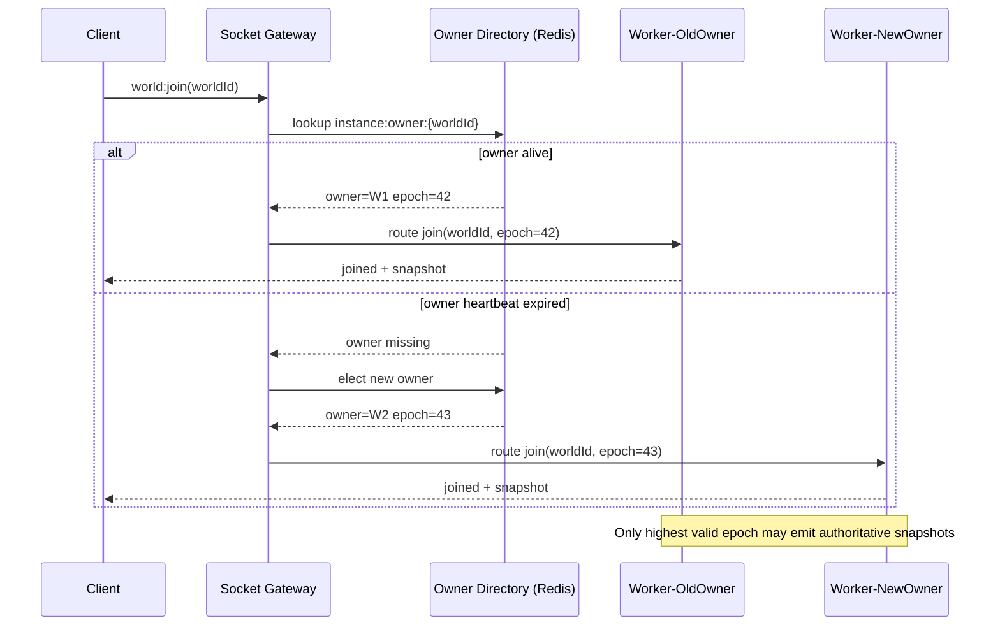
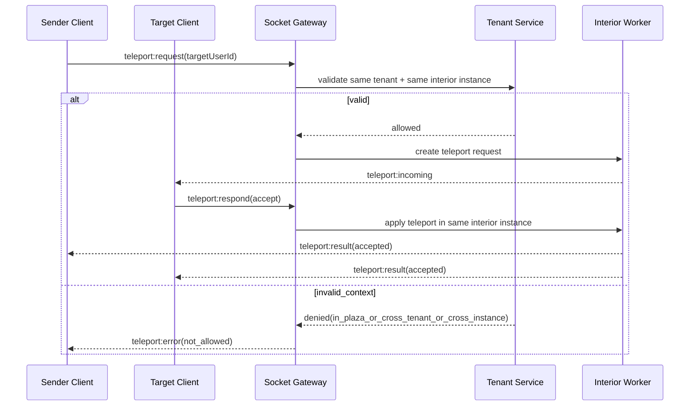

# Tenant Architecture Plan (Tenants + Worlds)

## 1. Purpose

Design a multi-tenant system for the current Gather codebase where:

- each user belongs to one home tenant,
- all tenant building/workspace exteriors exist in one shared **main plaza** map,
- each tenant has a dedicated **interior world instance** entered from its building exterior,
- tenants support two roles: `admin` and `member`,
- users can walk around the main plaza and enter interiors with a loading transition between instances,
- realtime presence/chat/tag/teleport/voice are isolated by the currently joined instance (`main_plaza` vs `tenant_interior`),
- main plaza has global text chat and no proximity/zone voice,
- teleport is used only inside tenant interiors for users in the same tenant and same interior instance,
- `revox` is an ordinary tenant like all other tenants (no special platform privileges).

This document is architecture-first and backend-focused, with explicit refactor notes for the current implementation.

---

## 2. Current Codebase State (What Exists Today)

### Auth + identity

- Supabase Auth is active in client (`AuthContext`), session token passed into Socket.IO.
- Server verifies Supabase JWT in `server/middleware/requireAuth.js`.
- No tenant state exists in DB or server runtime.

### Realtime server runtime

- Server keeps a single global `players` map in memory (`server/index.js`).
- `room:state`, `world:snapshot`, `chat:message`, `tag`, and `teleport` currently broadcast globally (or user-room targeted), not tenant/world partitioned.
- Teleport and chat services assume one shared world state.

### Client runtime

- Client socket hooks (`useSocket`, `useChat`) assume one active world session.
- Voice room naming is globally fixed (`gather-world` and zone variants), not tenant/world namespaced.

### Implication

Without tenant/world scoping, users from different tenants share presence and events unintentionally.

---

## 3. Target Architecture

## 3.1 System Overview

## 3.2 Core Multi-Tenant Principles

- **Tenant identity = tenant membership**.
- **Session entry point = shared main plaza** used as tenant selection/exploration surface.
- **World session identity = current instance** (`main_plaza` or `tenant_interior`).
- **Realtime isolation boundary = instance room** in Socket.IO.
- **Main plaza chat = one global text channel** (existing chat behavior).
- **Tenant interior chat/voice = instance-scoped only**.
- **Zone/privacy voice = interior-designated zones only** (never in main plaza).
- **Role enforcement boundary = tenant ownership/admin APIs**.
- **Durable tenant metadata = Postgres**; runtime movement/presence remains in-memory for PoC.

---

## 4. Data Model

## 4.1 Constraints and Rules

- One active membership per user in v1 (`UNIQUE(user_id)` where status=`active`).
- Exactly one shared main plaza row in `worlds` (`world_type='main_plaza'`).
- One interior world per tenant in v1 (`UNIQUE(tenant_id)` where `world_type='tenant_interior'`).
- `admin` can manage members/invites/settings of own tenant only.
- `member` can interact in worlds they can access but cannot administer tenant settings.

## 4.2 Required Database Tables and Relationships

### v1 Table Checklist

| Table                    |    Required in v1 | Purpose                                                         |
| ------------------------ | ----------------: | --------------------------------------------------------------- |
| `tenants`                |               yes | Tenant root entity.                                             |
| `tenant_memberships`     |               yes | User membership + role (`admin`/`member`) per tenant.           |
| `worlds`                 |               yes | Stores one shared main plaza world and tenant interior worlds.  |
| `tenant_invites`         |               yes | Invite workflow for joining tenants.                            |
| `world_links`            |    optional in v1 | Optional curated world-to-world travel graph.                   |
| `auth.users` (Supabase)  | external required | Identity source referenced by memberships/invites.              |

### Relationship Map (Implementation-Oriented)

- `tenants.id` -> `tenant_memberships.tenant_id` (one-to-many).
- `tenants.id` -> `worlds.tenant_id` (one-to-one for `tenant_interior`; `NULL` for main plaza).
- `tenants.id` -> `tenant_invites.tenant_id` (one-to-many).
- `worlds.id` -> `world_links.from_world_id` (one-to-many).
- `worlds.id` -> `world_links.to_world_id` (one-to-many).
- `tenant_memberships.user_id` -> `auth.users.id` (many-to-one).

### Minimum Constraint Set for Migrations

- `tenants.slug` unique.
- exactly one `main_plaza` world row.
- `worlds.tenant_id` unique where `world_type='tenant_interior'`.
- `worlds.world_type` constrained to `main_plaza|tenant_interior`.
- `tenant_memberships` partial unique active membership per user in v1.
- Foreign keys from all child tables to parent IDs with delete/update policies defined explicitly.
- Indexes on high-frequency lookups:
  - `tenant_memberships(user_id, status)`
  - `tenant_memberships(tenant_id, role, status)`
  - `worlds(world_type, tenant_id)`
  - `tenant_invites(tenant_id, status, expires_at)`

## 4.3 Tenant Database Best Practices (Shared DB / Shared Schema)

- Use one shared Postgres database and schema with strict tenant scoping.
- Every tenant-owned row must carry `tenant_id` (`NOT NULL`) and FK to `tenants(id)`.
- Allow explicit shared-world exceptions only where intended (for example the single `main_plaza` world row with `tenant_id=NULL`).
- Default to row-level security (RLS) on tenant tables:
  - allow access only when caller is an active member of the row's `tenant_id`.
  - bypass only for trusted backend service role.
- Never create tenant-visible unique constraints without `tenant_id` unless global uniqueness is intentional:
  - example: use `UNIQUE(tenant_id, key)` instead of global `UNIQUE(key)`.
- Prefer tenant-safe foreign keys for child tables:
  - include `tenant_id` on child rows and enforce parent references within same tenant.
- All reads/writes on tenant data must include an explicit tenant predicate, even when RLS exists.
- Index every high-frequency query by tenant first:
  - pattern: `(tenant_id, <secondary columns...>)`.

---

## 5. Authorization Model

### 5.1 Access Policies

- `main_plaza` access: any authenticated user can join.
- `public` tenant interior (v1 default): any authenticated user can enter from main plaza.
- `private` tenant interior: only tenant members (or explicitly authorized visitors in future) can enter.

### 5.2 Actions vs Roles

| Action                                                       | member | admin |
| ------------------------------------------------------------ | -----: | ----: |
| Walk in shared main plaza                                    |    yes |   yes |
| Read own tenant + own membership                             |    yes |   yes |
| Enter public tenant interiors                                |    yes |   yes |
| Enter private tenant interiors across tenants                |     no |    no |
| Send teleport request (same tenant, same interior instance)  |    yes |   yes |
| Send teleport request in main plaza or cross-tenant          |     no |    no |
| Invite users to own tenant                                   |     no |   yes |
| Remove member from own tenant                                |     no |   yes |
| Promote/demote roles in own tenant                           |     no |   yes |
| Change tenant access policy                                  |     no |   yes |

### 5.3 Server Enforcement Points

- HTTP middleware: verify token, resolve tenant context.
- REST admin endpoints: tenant ownership + role checks.
- Socket `world:join(main_plaza)` for initial entry.
- Socket `world:change(tenant_interior)`: interior access policy check.
- Event handlers: enforce same-instance semantics for interactions.

---

## 6. User Flows

## 6.1 Signup/Login -> Tenant Bootstrap

## 6.2 Join Shared Main Plaza Session

## 6.3 Enter Tenant Interior from Main Plaza

## 6.4 Admin Invite + Role Management

## 6.5 Horizontal Routing and Ownership Failover

## 6.6 Teleport Inside Interior Instance

---

## 7. Backend Refactor Plan (Current Code Mapped)

## 7.1 Tenant + world partition in server runtime (in-memory hot path)

Current:

- global `players` in `server/index.js`.

Target:

- `playersByWorld: Map<worldId, Map<userId, PlayerState>>`.
- world-scoped snapshot loop and broadcasting.
- socket joins both:
  - personal room: `user:{userId}`
  - active world room: `world:{worldId}`.

Notes:

- `playersByWorld` is runtime in-memory state on each realtime server node.
- `worldId` represents either the shared main plaza or a tenant interior world instance.
- It should contain only currently connected players in that world (not all registered users).
- Players outside the current world are naturally excluded from that world's broadcast loop.
- For visibility efficiency, layer an AOI/spatial index per world (grid/quadtree) so each player receives nearby entities, not every player in the world.
- This is the lowest-latency option for movement/snapshot hot paths in v1.

## 7.2 Tenant service layer

Add service (new module):

- `resolveTenantContext(userId)`
- `resolveMainPlazaWorld()`
- `resolveTenantInteriorWorld(tenantId)`
- `canAccessWorld(userId, worldId)`
- `isTenantAdmin(userId, tenantId)`

This removes tenant/role logic from socket handlers and keeps handlers focused on realtime behavior.

## 7.3 Event contract updates

- `player:join` should include `worldId` or be replaced by `world:join` then `player:join` world-local.
- `world:snapshot` payload includes `worldId` for safety and debugging.
- `chat:message`, `tag:send`, `teleport:*` all resolve and enforce same active instance.
- `teleport:request` is allowed only in `tenant_interior` and enforces same-tenant + same-instance between sender and target.

## 7.4 Teleport/Tag/Chat world scoping

- Teleport request store must key by `(worldId, senderId, targetId, tenantId)`.
- Tag target resolution must occur only among players in same world.
- Mentions should resolve only against world-local online users.
- Main plaza text chat is a single global channel (existing chat behavior is retained).
- Interior text chat is restricted to the active interior instance only.
- Presence in main plaza is plaza-scoped; presence inside interiors is interior-instance scoped.
- Teleport rule:
  - reject in `main_plaza` with `teleport:not_allowed_in_plaza`.
  - sender and target must both have active membership in the same tenant.
  - sender and target must both be in the same interior instance.
  - otherwise reject with `teleport:not_allowed_cross_tenant` or `teleport:not_same_instance`.

## 7.5 Voice isolation

- No proximity voice in `main_plaza`.
- LiveKit voice is enabled only for tenant interiors:
  - interior proximity: `gather-tenant-interior-{worldId}`
  - interior zone/privacy voice: `gather-world-{worldId}-zone-{zoneKey}`
- Zone/privacy voice is available only in designated interior zone spaces.
- Users must be in the same interior instance and same zone channel to hear each other.

> Scaling note: the PoC uses single-node in-memory player tracking per instance. Redis-based horizontal scaling, AOI snapshot optimization, and multi-node instance ownership are documented separately in [performance-and-scaling.md](performance-and-scaling.md).

---

## 8. Client Refactor Plan

## 8.1 Tenant context

Add a `TenantContext` after auth:

- `homeTenantId`
- `role`
- `mainPlazaWorldId`
- `homeInteriorWorldId`
- `currentWorldId`
- `currentInstanceType` (`main_plaza|tenant_interior`)
- loading/error state

## 8.2 Bootstrap gate

Route behavior:

- authenticated but no membership -> show tenant bootstrap screen.
- authenticated + membership -> allow `/game` entry.

## 8.3 Socket + hooks

- `useSocket` becomes world-aware and supports `world:change`.
- `useChat` supports two modes:
  - main plaza: global text chat channel (current behavior).
  - tenant interior: instance-scoped text chat.
- presence selectors use world-local remote players only.

## 8.4 UX entry points

- Main plaza auto-entry on session start (acts as tenant selection map).
- User walks to a tenant house exterior door to trigger `world:change` into that tenant interior.
- Exiting an interior returns player to main plaza at the corresponding exterior door location.
- Temporary pre-Tiled testing strategy: remap existing `dev/design/game` zone triggers in main plaza as portal triggers for `world:change`.
- When Tiled map portal entities are added, remove this temporary zone remapping and switch to dedicated portal triggers.

## 8.5 World transitions (loading screen)

- Crossing a portal triggers `world:change`.
- Client shows a loading screen while the server switches the player to the target instance.
- Once `world:change` ack is received with spawn position and instance snapshot, the loading screen is dismissed and the game resumes.

---

## 9. API and Event Interfaces (v1)

## 9.1 REST

- `GET /tenant/me`
  - returns tenant, role, `mainPlazaWorldId`, `homeInteriorWorldId`, and current defaults.
- `POST /tenant/bootstrap`
  - `{ mode: "create_tenant", tenantName }` or `{ mode: "join_invite", inviteToken }`.
- `POST /tenants/:tenantId/invites` (admin)
- `PATCH /tenants/:tenantId/members/:userId/role` (admin)
- `DELETE /tenants/:tenantId/members/:userId` (admin)
- `PATCH /tenants/:tenantId/settings` (admin, includes `access_policy`).

## 9.2 Socket

- `world:join` request/ack
- `world:change` request/ack
- existing movement/tag/teleport events continue, and server enforces active instance membership.
- `chat:message` behavior:
  - in `main_plaza`: publish to global plaza text channel.
  - in `tenant_interior`: publish only to that interior instance room.
- `teleport:request` behavior:
  - allowed only in `tenant_interior` (disabled in `main_plaza`).
  - allowed only when sender/target belong to the same tenant and same interior instance.
  - cross-tenant or cross-instance request is rejected.

---

## 10. Migration and Rollout

Detailed execution steps are documented in [`tenant-implementation-plan.md`](./tenant-implementation-plan.md).

## 10.1 Data migration strategy

- Seed one shared main plaza world row (`world_type='main_plaza'`).
- For existing tenants, ensure one interior world exists per tenant.
- For existing users, assign/migrate into a default tenant and default interior world on first tenant bootstrap.

## 10.2 Incremental rollout phases

1. DB schema + tenant REST bootstrap.
2. Socket instance scoping for main plaza + interior world join/change.
3. Interaction scoping (chat/tag/teleport) and voice room namespacing.
4. Admin tooling and hardening.
5. Horizontal scaling rollout — see [performance-and-scaling.md](performance-and-scaling.md).

---

## 11. Testing and Acceptance Criteria

### Functional

- All authenticated users can walk in the shared main plaza and see tenant house exteriors.
- Main plaza text chat is global and visible to all users currently in main plaza.
- Users inside tenant interiors never leak presence/snapshots/messages to other interiors.
- Public tenant interior entry succeeds; private tenant interior entry denies non-members.
- Admin can invite/promote/remove members in own tenant.
- Member cannot call admin endpoints.

### Realtime safety

- `world:change` cleans up old world state and emits correct new snapshot.
- Entering/exiting interiors transitions between main plaza and tenant interior without stale state carryover.
- Teleport/tag only operate within current instance.
- Teleport requests are accepted only for same-tenant sender/target pairs in the same interior instance.
- Teleport requests are rejected in `main_plaza`.
- Interior text chat is restricted to that interior instance and never leaks to other interiors or plaza.
- Disconnect cleanup only affects relevant instance.
- Loading screen is shown on `world:change` and dismissed only after server ack with valid spawn and snapshot.

### Voice

- Main plaza has no proximity voice channel.
- Proximity voice only works inside tenant interior instances.
- Zone/privacy voice only works inside designated interior zone spaces.
- Users in different interior instances never share proximity/zone audio rooms.

### Security

- All tenant-sensitive endpoints validate role and tenant ownership.
- No trust in client-provided tenant/role without server resolution.
- Teleport authorization resolves sender/target tenant and instance server-side and blocks invalid requests.

### Scalability

- Realtime events are emitted to instance-scoped rooms, not global broadcasts.
- Horizontal scaling, cross-node handoff, and plaza sharding acceptance criteria are defined in [performance-and-scaling.md](performance-and-scaling.md).

---

## 12. Open Naming Decision (Non-Blocking)

Product naming (`world` vs `island` vs `house`) can remain a UI concern. Keep backend keys and APIs on neutral term `world` for consistency and to avoid repeated refactors.

---

## 13. Architecture Review — Issues and Suggested Improvements

> Note: This section was generated by Claude (claude-sonnet-4-6) via automated architecture review against the live codebase. Treat it as a peer review, not a spec change.

---

### Critical Issues (Blockers)

#### 13.1 Map loading pipeline is completely absent

The plan introduces a `worlds` table with a `map_key` column and implies multiple distinct worlds (main plaza + N tenant interiors), but nowhere defines:
- How the server loads collision/zone data for a given `map_key`.
- Whether tenant interiors reuse a shared map file or have per-tenant map files.
- How `loadWorldData()` in `server/index.js` becomes world-aware — currently it reads one hardcoded LDtk file at boot.

**Clarification (post-review):** The codebase will migrate from LDtk to Tiled JSON entirely — both main plaza and tenant interiors will use Tiled JSON. Phaser has a dedicated Tiled loader which makes this the natural format for the client. The server must parse Tiled JSON to extract collision and zone data server-side. This eliminates dual-format handling and simplifies the pipeline.

This is load-bearing. Without it, `world:join` cannot spawn players because the server has no collision data for the target world. Phase 1 cannot complete without this.

**Fix:** Add a `worldLoader` module to the refactor plan with the following explicit contract:
- Input: `map_key` string (e.g. `"main_plaza"` or `"interior_default"`)
- Output: `{ collisionCsv, gridWidth, gridHeight, zones }`
- Format: Tiled JSON exclusively — LDtk parsing can be dropped once migration is complete
- Caching: load once per `map_key` at world instance creation; do not reload per tick
- Migration note: `hub.ldtk` must be converted to Tiled JSON and the existing `loadWorldData()` collision/zone extraction logic rewritten for Tiled's layer structure (`type: "tilelayer"` for collision, `type: "objectgroup"` for zones)
- Define where `.tmj`/`.json` map files are served from and whether the server reads them from disk or fetches them from the client's public asset path

---

#### 13.2 TenantService is a single point of failure with no degradation path

Every socket event flow (`world:join`, `world:change`, `teleport`, LiveKit token) gates on TenantService resolving the user's tenant context. If TenantService is down or Postgres is slow, no player can join main plaza, no voice room can be issued, and no teleport can proceed.

Section 7.8.6 defines worker crash recovery but says nothing about TenantService failure. The claim that "cold path always works when warm cache misses" is false if TenantService is unavailable.

**Fix:** Either (a) cache tenant context in memory after first resolution with a TTL so a brief Postgres outage doesn't disconnect all players, or (b) explicitly document that Postgres downtime = no new joins and treat it as an accepted constraint.

---

#### 13.3 LiveKit token endpoint redesign is understated

The current server has `ALLOWED_ROOMS` as a static `Set`. The plan renames rooms to `gather-tenant-interior-{worldId}` — but the token endpoint must now dynamically validate `worldId` as a legitimate tenant interior and confirm the requesting user has access to that world. This requires TenantService to be online before voice works at all. The client's hardcoded `ROOM_NAME = 'gather-world'` in `client/src/utils/voiceRoom.ts` must also become world-aware. This dependency is absent from the rollout phases.

**Fix:** Add a dedicated LiveKit refactor phase to the rollout. It should not be bundled with "interaction scoping" (phase 3). It touches server token auth, client room naming, and requires the tenant service to be available first.

---

#### 13.4 Membership constraint conflicts with visitor presence tracking

Section 4.1 enforces one active membership per user. Section 5.1 allows any authenticated user to enter public tenant interiors. A non-member visitor inside a public interior instance has no tenant membership — so chat mention resolution, tag targeting, and teleport validation inside that instance are all undefined. The teleport rule requiring "same tenant membership" silently blocks non-member visitors from teleporting even inside instances they've legitimately entered. This is a hidden behavioral constraint that will be implemented inconsistently.

**Fix:** Explicitly state whether non-member visitors can: send chat, appear in mentions, be teleported to, and appear in tag resolution. These need defined behaviors, not implicit ones.

---

### Major Concerns

#### 13.6 ~~Seamless prefetch is PoC-inappropriate complexity~~

Resolved. Prefetch / LRU warm cache has been removed from the plan entirely. Instance transitions will show a loading screen until the server ack is received. Sections 6.5, 7.6, and 8.5 have been updated accordingly.

---

#### 13.7 Rollout phases do not include RLS

Section 4.3 mandates row-level security. None of the five rollout phases mention enabling it. If tables are deployed without RLS and the service role is used throughout, this must be explicitly stated — otherwise RLS will silently not be implemented.

**Fix:** Add RLS enablement as an explicit step in phase 1 or document it as a post-v1 hardening task with a clear rationale for the deferral.

---

#### 13.8 `teleportRequests` store has no instance key

The current `TeleportRequestsStore` is keyed by userId with a global cooldown. The plan requires keying by `(worldId, senderId, targetId, tenantId)`. This is a complete rewrite of the store's key space, expiry logic, and cross-disconnect cleanup. The plan mentions the new key structure (Section 7.4) but does not flag this as a breaking change to the existing store.

---

#### 13.9 `world:snapshot` broadcast loop must be rewritten

`io.emit('world:snapshot', ...)` in `server/index.js` broadcasts to every connected client. The plan requires this to become `io.to('world:{worldId}').emit(...)`. This means the snapshot loop must iterate over `playersByWorld` and emit N separate snapshots per tick for N active instances. Running N snapshot loops at 20 Hz has different memory and CPU characteristics than one. This is not called out as a performance boundary.

---

#### 13.10 ~~Main plaza sharding mixed into v1 without scope boundary~~

Resolved. Redis horizontal scaling, plaza sharding, and instance ownership model have been moved to [performance-and-scaling.md](performance-and-scaling.md). The tenant plan now uses single-node in-memory player tracking for the PoC.

---

### Missing Considerations

#### 13.11 Disconnect teardown sequence is undefined

Current disconnect cleanup removes from the global `players` object and broadcasts `player:left` globally. Post-refactor, disconnect must: identify which instance the player was in, remove from `playersByWorld[worldId]`, clear teleport requests scoped to that instance, emit `player:left` only to the instance's Socket.IO room, and trigger voice disconnect cleanup for that instance's LiveKit room. None of this is defined in the refactor plan and will be implemented inconsistently.

**Fix:** Add a disconnect teardown sequence to Section 7 as a dedicated subsection listing the ordered cleanup steps per instance.

#### 13.12 Supabase token rotation mid-session is unaddressed

Supabase access tokens expire (typically 1h). The client patches `socket.auth` on token refresh but the server never re-validates mid-session. For long gaming sessions this is a security gap. The plan does not address it.

#### 13.13 `WORLD_LINKS` inconsistency in the ERD

`WORLD_LINKS` is marked "optional in v1" in the checklist but appears as a full relationship in the ERD. Engineers reading the ERD will assume it requires implementation. Either remove it from the ERD or add a visual marker indicating it is deferred.
