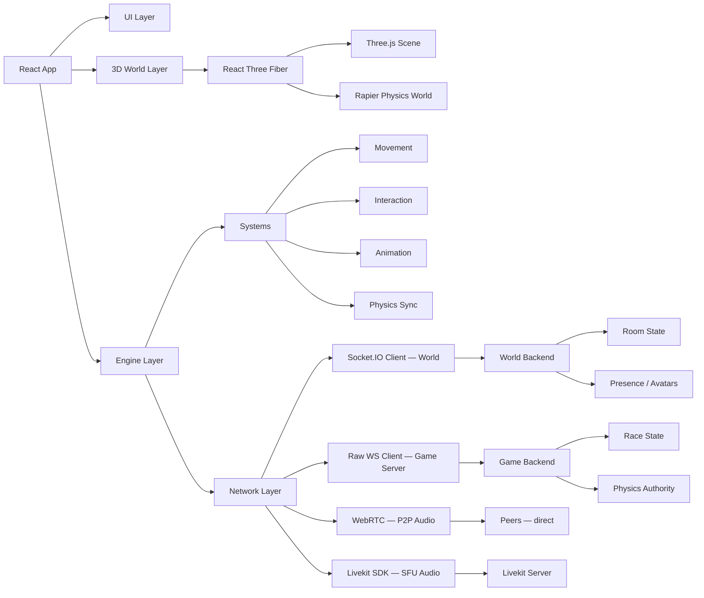

# Virtual Workspace (Gather/Club Penguin Style) – PoC Architecture

This document outlines a **the architecture** for building a virtual collaborative workspace with embedded minigames using:

- React
- Three.js (via React Three Fiber)
- Rapier (via @react-three/rapier) — physics
- Node.js backend
- Socket.IO — world/presence layer
- WebSockets (raw) — game server layer
- WebRTC — proximity audio/video (open world)
- Livekit — SFU audio for designated spaces (boardrooms, stages)

---

# Core Principle

> **Three.js is a rendering layer — NOT your architecture**

Three.js renders what your engine simulates. Rapier handles all physics (collision, forces, rigid bodies). They are complementary, not overlapping.

Your system splits into four layers:

- **Rendering Layer** → Three.js / R3F
- **Physics Layer** → Rapier (via @react-three/rapier)
- **Engine Layer** → Game logic, systems, entities
- **Network Layer** → Multiplayer sync (dual connection model)
- **UI Layer** → React (HUD, menus, overlays)

---

# Architecture Decisions

| Decision | Choice | Rationale |
|---|---|---|
| Renderer | Three.js via R3F | Industry standard, large ecosystem, R3F reduces boilerplate |
| Physics | Rapier (@react-three/rapier) | Rust/WASM performance, native R3F integration, handles kart physics well |
| World sync | Socket.IO | Built-in rooms, reconnection, acknowledgements — latency tolerance ~200ms is fine for presence |
| Game sync | Raw WebSocket | Racing needs ~60Hz tick rate at <50ms latency — Socket.IO overhead not acceptable here |
| Open world audio | WebRTC (P2P) | Proximity-based, direct peer connections, scales fine up to ~8-10 people in range |
| Boardroom audio | Livekit (SFU) | Zone-triggered, everyone-hears-everyone, single upload per client regardless of room size |

---

# High-Level Architecture



---

# Two-Layer Network Model

The world layer and game layer have fundamentally different sync requirements and run as separate connections.

## World Layer (Socket.IO)

Handles ambient presence — who is in a room, where they are, what they look like.

- Tick rate: ~10–20Hz
- Latency tolerance: ~200ms
- Client-authoritative movement (server broadcasts positions)
- Events: `player:join`, `player:leave`, `player:move`, `player:emote`

## Game Layer (Raw WebSocket)

Handles minigame simulation — go-kart racing and other fast-paced games.

- Tick rate: ~60Hz
- Latency tolerance: <50ms
- Client-side prediction + server reconciliation
- Fixed timestep game loop, decoupled from render loop
- Events: `game:input`, `game:state`, `game:tick`, `game:end`

When a player enters a minigame, a second WebSocket connection opens to the game server. On exit, it closes. The world layer remains connected throughout.

---

# Physics Architecture (Rapier)

Rapier runs in the browser via WASM. `@react-three/rapier` wraps it for R3F.

## World Physics
- Colliders on walls, objects, zones (no rigid body simulation needed — static only)
- Used for: collision blocking, interaction zone detection, proximity triggers

## Game Physics (Go-Kart)
- Rigid bodies on karts
- Forces applied from player input (acceleration, steering torque)
- Constraints for wheel suspension
- Collision between karts and track geometry
- Server runs a headless Rapier simulation (Node.js + rapier-compat) for authoritative state
- Client runs its own simulation for prediction, corrects when server state diverges

---

# Room / Space Design

- Spaces are tile-grid based at the data layer (collision map, spawn points, zone definitions)
- Rendered as free 3D geometry (not constrained to visible grid)
- Each room has:
  - `id`, `name`, `capacity`
  - Collision map (static Rapier colliders)
  - Spawn zones (entry points per door/portal)
  - Interaction zones (trigger areas for games, media, objects)
  - Ambient config (lighting, music, skybox)

---

# Avatar & Presence System

Each player entity has:

```ts
type Avatar = {
  id: string           // socket session id
  userId: string       // persistent user id
  displayName: string
  skin: string         // asset key
  position: [x, y, z]
  rotation: number     // Y axis only for top-down feel
  state: 'idle' | 'walking' | 'sitting' | 'in-game'
  away: boolean
}
```

- Name tags rendered in world space (R3F `<Html>` or billboard sprite)
- Animation state machine: idle → walk → sit
- Ghost/away state dims the avatar and shows an indicator
- Avatars not owned by local player are interpolated (lerp between received positions)

---

# State Management

Client state split by concern:

| Store | Contents | Tool |
|---|---|---|
| World store | Room, all avatars, local player | Zustand |
| Game store | Race state, lap times, leaderboard | Zustand |
| UI store | Modals, HUD visibility, settings | Zustand |
| Physics | Managed internally by Rapier | @react-three/rapier |

No Redux. Zustand is lightweight and works well with R3F's render loop access pattern (`useFrame` + `useStore`).

---

# Audio Model

Two modes coexist depending on the space type. Switching between them is triggered by zone entry/exit events from the interaction zone system.

## Mode 1: Proximity Audio — Open World (WebRTC P2P)

Used in: hallways, open spaces, desks, anywhere without a designated audio zone.

- Each player maintains direct WebRTC peer connections with others in range
- On `player:join`, client initiates WebRTC handshake via Socket.IO signaling relay
- Audio volume scales with distance using a Web Audio API gain node:
  ```ts
  gainNode.gain.value = 1 - (distanceToPeer / MAX_DISTANCE)
  ```
- Hard cutoff at ~10 world units (configurable per room)
- Scales well up to ~8–10 simultaneous nearby peers
- STUN: Google public servers for PoC
- TURN: Required for production (corporate NAT traversal) — Twilio or self-hosted coturn

## Mode 2: Zone Audio — Boardrooms & Stages (Livekit SFU)

Used in: boardrooms, presentation stages, any space where everyone should hear everyone.

- Powered by [Livekit](https://livekit.io) — open-source SFU with a JS SDK
- Each client uploads audio once to the Livekit server, which fans it out to all participants
- Scales to any room size without client connection count growing
- Zone entry triggers:
  1. Tear down active P2P WebRTC connections
  2. Connect to the Livekit room for this space (room ID maps to the zone ID)
- Zone exit reverses the process — reconnect to P2P mesh
- Video (webcam) can optionally be enabled in boardroom zones via the same Livekit connection

## Audio Zone Room Config

Room definitions include an optional `audioZone` on interaction zones:

```ts
type InteractionZone = {
  id: string
  shape: 'box' | 'cylinder'
  bounds: [x, y, z, w, h, d]
  type: 'game' | 'media' | 'audio'
  audioZone?: {
    mode: 'sfu'
    livekitRoom: string   // maps to a Livekit room name
    videoEnabled: boolean
  }
}
```

---

# Backend Structure

```
/server
  /world          — Socket.IO server, room state, presence
  /game           — Raw WS game server, physics authority, tick loop
  /signaling      — WebRTC offer/answer relay (uses Socket.IO)
  /api            — REST: auth, user profiles, room config
```

Room state is in-memory for PoC. Redis pub/sub for horizontal scaling later.

---

# Auth & Sessions

- PoC: anonymous sessions with a generated guest ID + display name
- Persistent identity: JWT-based auth, stored in httpOnly cookie
- User profile (display name, avatar skin, settings) fetched on load
- Socket.IO handshake attaches JWT for server-side identity

---

# Deployment (PoC Targets)

| Service | Target |
|---|---|
| Frontend | Vercel |
| World + Signaling server | Railway or Fly.io |
| Game server | Fly.io (low latency routing matters here) |
| Livekit server | Livekit Cloud (free tier for PoC) or self-hosted on Fly.io |
| STUN | Google public (stun.l.google.com) |
| TURN | Defer to post-PoC |

---

# Open Questions

- Map authoring: hand-coded scenes vs. a simple editor?
- Minigame roster beyond go-kart (what's next — trivia? platformer?)
- Persistent game stats / leaderboards?
- Mobile support (touch controls for kart)?
